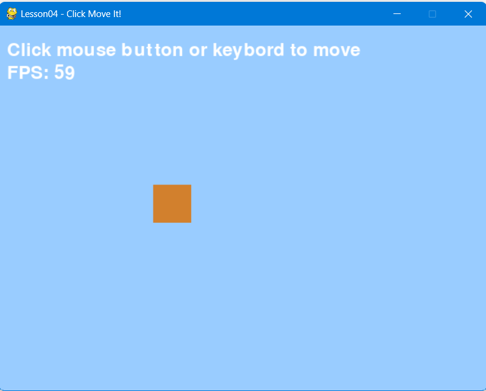
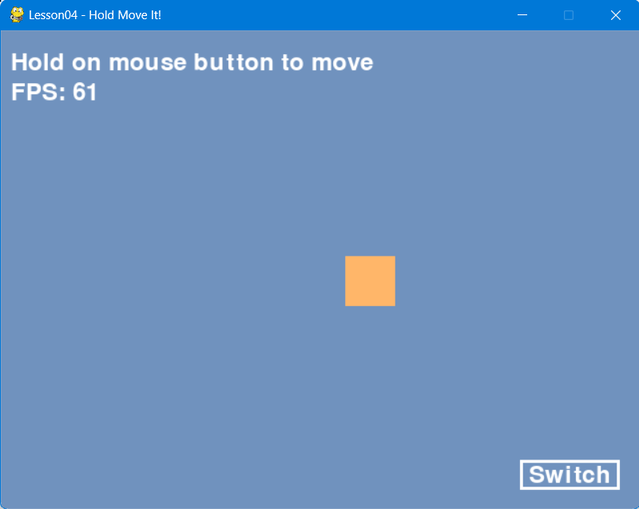
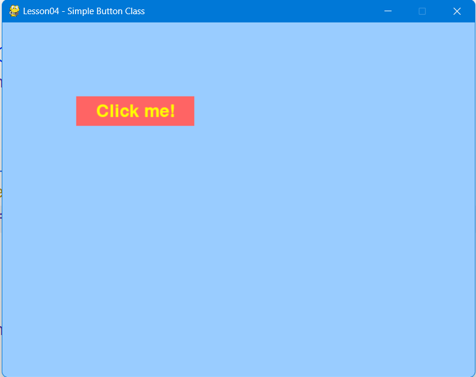

# Lesson04 - 输入系统与交互判定

## 学习目标

1. 掌握键盘/鼠标的两种检测模式：**事件触发**（单次动作）与**状态轮询**（持续状态）；
2. 理解掌握点与矩形、点与圆形的碰撞检测方法；
3. 能够手写实现以下交互场景：单击移动、长按移动、UI 按钮（含 hover）、可拖拽物体；
4. 了解主流游戏引擎（Godot、Unity）中的输入抽象层，建立从底层 API 到引擎特性的映射思维。

## 重点理解

- **输入系统的两种检测模式**
  - **事件触发（Event-driven）**：操作系统将每个输入动作包装为事件，游戏每帧处理事件队列。适合单次动作（跳跃、射击、菜单确认），精确捕捉“按下瞬间”，但不适合持续移动（依赖系统重复速率）。典型 API：`pygame.KEYDOWN` / `KEYUP`、`MOUSEBUTTONDOWN` / `UP`。
  - **状态轮询（Polling）**：每帧主动查询输入设备的当前瞬时状态。适合持续动作（移动、拖拽、加速），实时反馈所有按住键，但无法区分“刚按下”与“一直按住”，需额外记录上一帧才能检测边缘触发。典型 API：`pygame.key.get_pressed()`、`pygame.mouse.get_pressed()`。
  - **经验法则**：“按一下做一次”用事件，“按住一直做”用轮询。
- **碰撞检测基础（用于 UI 与拾取）**
  - 点与矩形（Point in Rect）：矩形定义为 `(left, top, width, height)`，点 `(px, py)` 命中条件为 `left ≤ px ≤ left+width` 且 `top ≤ py ≤ top+height`。适用于按钮、图片框、网格格子。典型 API：`pygame.Rect.collidepoint(px, py)`。
  - 点与圆形（Point in Circle）：圆心 `(cx, cy)`，半径 `r`，命中条件为 `(px-cx)² + (py-cy)² ≤ r²`。适用于圆形按钮、单位选取、拖拽手柄。典型 API：`pygame.circle.collidepoint(px, py)`。
  - 以上检测是 UI 交互的数学本质：**鼠标坐标 + 几何碰撞判定**。
- **鼠标交互与坐标转换**
  - 获取鼠标状态：轮询用 `pygame.mouse.get_pos()` 返回屏幕坐标 `(x, y)`（左上角原点，右/下为正）；事件中用 `MOUSEMOTION` 携带 `pos`、`rel`（相对移动）和 `buttons`。
  - 坐标转换的必要性：当存在摄像机滚动/缩放时，屏幕坐标必须与世界坐标相互转换。
  - 转换公式（2D 无缩放）：世界坐标 = 屏幕坐标 + 摄像机偏移；屏幕坐标 = 世界坐标 − 摄像机偏移。
  - 在 Pygame 中，绘制时应用 `camera` 偏移：`blit(obj, (obj.x - camera.x, obj.y - camera.y))`；点击检测时需将鼠标坐标加上 `camera` 才能命中世界物体。

## 动手练习

1\. 鼠标跟踪与长按移动：靠方向键/鼠标点击移动方块；靠方向键/鼠标键长按移动方块。

2\. 三态按钮带回调：创建一个灰色按钮，鼠标悬浮变蓝，点击时变红，释放后触发控制台打印 “Clicked!”。

3\. 可拖拽圆形 + 边界限制：实现一个圆形，鼠标按下并移动时可拖拽，但不能移出窗口边界。

4（综合-选做）：摄像机跟随下的世界物体点击：实现一个 1000x1000 的大地图，摄像机跟随玩家方块。鼠标点击地图上的任意静态圆点时，控制台输出“命中世界物体”。

## 🔁 映射引擎原理

无论引擎如何，底层逻辑仍是**事件 vs 轮询**的组合。引擎只是用更舒适的方式封装了它们。

### Godot

- **事件触发**：重写 `_input(event: InputEvent)` 方法。适合单次动作。
- **状态轮询**：`Input.is_action_pressed("ui_right")`，适合持续移动。
- **统一动作映射**：通过“输入映射”将按键绑定到动作名（如 `"jump"`），解耦硬编码键位。

### Unity

- **事件触发**：`OnMouseDown()`、`OnPointerClick()`（需 `IPointerClickHandler`）。
- **状态轮询**：`Input.GetKey(KeyCode.W)` 或 `Input.GetAxis("Horizontal")`。
- **新输入系统**：提供更高级的事件+轮询混合，支持设备切换。

### Unreal Engine

- **事件触发**：`SetupPlayerInputComponent` 中绑定 `BindAction`（按下/抬起）。
- **状态轮询**：`BindAxis` 返回连续值，适合移动。
- **增强输入**：类似 Godot 的动作映射。

## 效果图

点击移动：

长按移动：

三态按钮：

